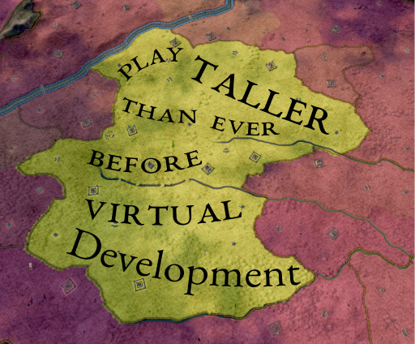

# Virtual Development
Virtual Development is a mod that tries to work around the 100 Development limit Pradox set for us.

## How it works
- Once a year Checks if counties are above a threashold limit set by game_rule
- If Development at or above limit we remove 10 "real" Development and give the county a buff that gives the same boni as Development would.
- Each 10 VDev grants: +5% Taxes, +5% Levy Size, +1500 Supply Limit (up to +50% / +15,000 at 100 VDev). Same as normal Development

## Why use it
- You wanna go taller!

## Notes
- No Vanilla Overwrites and thus should be compatible with any other mod. Should also be savegame compatible
- Also safe to remove from existing saves

## Future Plans
- Once I figure out how to make this a scalable value vDev limit could be configurable
- Maybe Powerful Lategame Upgrades you can only buy with VDev

Enjoy building tall without wasting dev!
